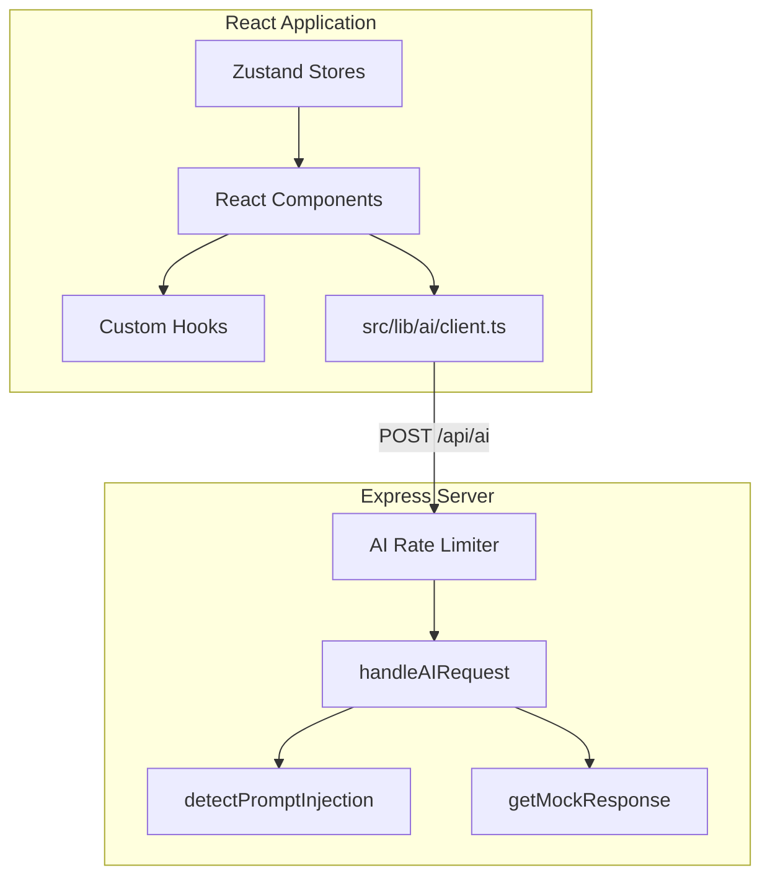

# System Architecture - Pulse Path

Pulse Path is a smart stadium management and navigation platform. This document outlines the core architectural patterns, directories, and entry points of the application.

## Directory Structure

```
Pulse Path/
├── .github/                # CI/CD Workflows
├── server/                 # Express backend source files
│   ├── controllers/        # Route logic and controllers
│   ├── middleware/         # Hardened security & performance middlewares
│   ├── services/           # Backend business logic and mock APIs
│   └── utils/              # Security and prompt sanitization utilities
├── src/                    # Vite React Frontend
│   ├── components/         # Modular layout, fan, and map subcomponents
│   ├── data/               # Static stadium layout configuration, zones, and scenarios
│   ├── hooks/              # Custom React state hooks (e.g. simulation ticker)
│   ├── pages/              # Responsive dashboard views for Fan/Ops/Volunteer/Accessibility
│   ├── store/              # Zustand global client-side state managers
│   ├── App.tsx             # Routing layout entries
│   └── main.tsx            # DOM initialization entry
├── server.ts               # Root Express listener and Vite dev mode configuration
└── vite.config.ts          # Frontend build configuration and optimization settings
```

## Client-Server Boundary



### 1. Communication Boundary

- **REST Endpoints**: The client connects to the server for AI queries (`/api/ai`) and health validation (`/api/health`).
- **Development Server**: In dev mode (`process.env.NODE_ENV !== 'production'`), Express maps Vite middlewares to serve the React application with HMR.
- **Production Server**: In production mode, Express serves the statically built assets in `dist/` with long-term caching header configuration (`Cache-Control`).

### 2. State Management (Zustand)

- **`app-store.ts`**: Manages global UI preferences (e.g., active role, language switcher).
- **`user-store.ts`**: Manages user specific state (onboarding data, current zones).
- **`simulation-store.ts`**: Manages the running simulated metrics of the stadium (wait times, crowd density fluctuation).

## Key Entry Points

- **Express Entrypoint**: `server.ts` (starts backend or hooks Vite middleware).
- **Frontend Entrypoint**: `src/main.tsx` (renders the React application).
- **Routing Engine**: `src/App.tsx` (orchestrates route navigation structures).
